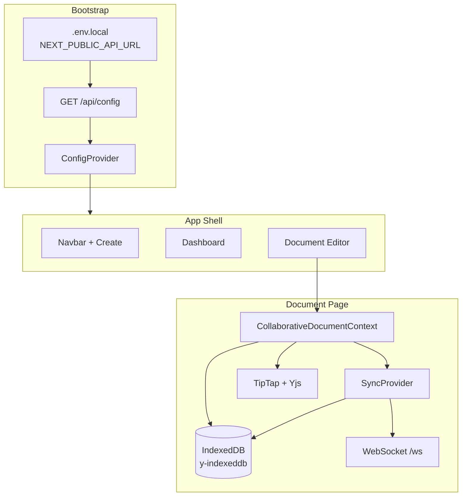
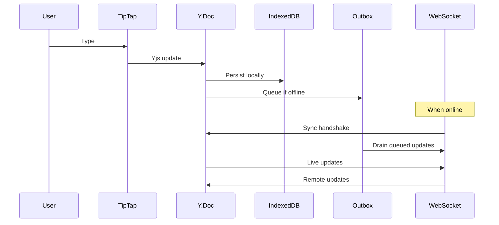

# Collaborative Editor Client

Next.js 16 frontend for a **local-first collaborative document editor**. Uses **TipTap** + **Yjs** for rich-text CRDT editing, **IndexedDB** for offline persistence, and a **server-driven runtime config** so limits, URLs, and protocol constants are never hardcoded.

---

## Table of contents

- [Features](#features)
- [Architecture](#architecture)
- [Tech stack](#tech-stack)
- [Prerequisites](#prerequisites)
- [Quick start](#quick-start)
- [Environment variables](#environment-variables)
- [Runtime config](#runtime-config)
- [Pages & routing](#pages--routing)
- [Project structure](#project-structure)
- [Key modules](#key-modules)
- [Offline & sync flow](#offline--sync-flow)
- [UI design system](#ui-design-system)
- [Scripts](#scripts)
- [Troubleshooting](#troubleshooting)

---

## Features

- Register / login with JWT stored in `localStorage`
- Document dashboard with create-from-header or inline form
- Real-time collaborative rich-text editor (bold, italic, headings, lists, quotes)
- **Local-first** — edits persist to IndexedDB immediately; sync when online
- Offline outbox queues updates and drains after WebSocket handshake
- Version history sidebar — save and restore snapshots
- Document sharing UI (owner invites by email)
- Connection status indicator (offline / connecting / syncing / synced)
- Optional AI improve button (when server has `OPENAI_API_KEY`)
- Light-theme UI with consistent design tokens (Windows dark-mode safe)

---

## Architecture



**Provider hierarchy** (`app/layout.tsx`):

```
ConfigProvider → ApiProvider → DocumentsProvider → pages
```

---

## Tech stack

| Layer | Technology |
|-------|------------|
| Framework | Next.js 16 (App Router) |
| UI | React 19, Tailwind CSS 4 |
| Editor | TipTap 3 + StarterKit |
| CRDT | Yjs, y-prosemirror, y-protocols |
| Offline | y-indexeddb, custom IndexedDB outbox |
| Icons | lucide-react |

---

## Prerequisites

- **Node.js** 18+
- Backend running at `http://localhost:8000` (or your configured URL)
- MongoDB configured on the server

---

## Quick start

```bash
# 1. Install
cd collaborative-editor-client
npm install

# 2. Configure bootstrap URL (must match backend PORT)
cp .env.local.example .env.local

# 3. Start dev server
npm run dev
```

Open [http://localhost:3000](http://localhost:3000).

**First-time flow:** Register → create a document → edit collaboratively.

> Restart `npm run dev` after changing `.env.local` — Next.js bakes `NEXT_PUBLIC_*` at startup.

---

## Environment variables

`.env.local` (see `.env.local.example`):

| Variable | Required | Description |
|----------|----------|-------------|
| `NEXT_PUBLIC_API_URL` | Yes | Backend REST URL, e.g. `http://localhost:8000` |
| `NEXT_PUBLIC_WS_URL` | No | WebSocket URL, e.g. `ws://localhost:8000/ws` |

Optional overrides (normally loaded from server `/api/config`):

| Variable | Description |
|----------|-------------|
| `NEXT_PUBLIC_WS_PATH` | WebSocket path if not using full `WS_URL` |
| `NEXT_PUBLIC_YJS_FIELD` | Yjs field name override |
| `NEXT_PUBLIC_*` limits | Password/title/snapshot length overrides |

**Important:** Env vars must be referenced statically in code (see `lib/config/static.ts`) for Next.js to inline them in the client bundle.

---

## Runtime config

On startup, `ConfigProvider` calls `loadRuntimeConfig()`:

1. Read `NEXT_PUBLIC_API_URL` from env (bootstrap).
2. Fetch `GET /api/config` from the server.
3. Merge server values with client env overrides.
4. Expose via `useAppConfig()` and `createApi(config)`.

```typescript
import { useAppConfig } from "@/lib/config";
import { useApi } from "@/lib/ApiProvider";

const config = useAppConfig(); // wsUrl, limits, yjsField, features.ai, ...
const api = useApi();            // typed REST client
```

**What comes from the server**

| Concern | Config key |
|---------|------------|
| API / WS URLs | `apiUrl`, `wsUrl` |
| Yjs field | `yjsField` |
| Message size cap | `limits.maxMessageSize` |
| Validation bounds | `limits.password*`, `limits.titleMaxLength`, … |
| Sync timing | `sync.heartbeatMs`, `sync.reconnectMs` |
| IndexedDB / outbox names | `storage.*` |
| Shareable roles | `roles` |
| AI feature flag | `features.ai` |

---

## Pages & routing

| Route | Description |
|-------|-------------|
| `/` | Redirects to `/dashboard` |
| `/login` | Sign in |
| `/register` | Create account |
| `/dashboard` | Document list + create form |
| `/documents/[id]` | Collaborative editor |

Authenticated routes use `app/(app)/layout.tsx` → `AppShell` (navbar with **Create new**).

---

## Project structure

```
collaborative-editor-client/
├── app/
│   ├── layout.tsx              # Root providers
│   ├── globals.css             # Design tokens + components
│   ├── (app)/                  # Authenticated shell
│   │   ├── layout.tsx          # AppShell + Navbar
│   │   ├── dashboard/page.tsx
│   │   └── documents/[id]/page.tsx
│   ├── login/page.tsx
│   └── register/page.tsx
├── components/
│   ├── AppShell.tsx
│   ├── Navbar.tsx
│   ├── CreateDocumentButton.tsx
│   ├── CreateDocumentForm.tsx
│   ├── CollaborativeEditor.tsx
│   ├── EditorToolbar.tsx
│   ├── ShareDocument.tsx
│   ├── VersionHistory.tsx
│   ├── ConnectionStatus.tsx
│   └── RoleBadge.tsx
├── contexts/
│   ├── CollaborativeDocumentContext.tsx  # Y.Doc lifecycle
│   └── DocumentsContext.tsx              # create + list docs
├── lib/
│   ├── api.ts                  # REST client factory
│   ├── auth.ts                 # JWT + localStorage
│   ├── config/                 # Runtime config loader
│   └── sync/
│       ├── SyncProvider.ts     # WebSocket + outbox
│       └── outbox.ts           # IndexedDB offline queue
└── types/index.ts
```

---

## Key modules

### `DocumentsContext`

Central document operations — used by dashboard and navbar **Create new**:

- `createDocument(title)` — creates doc and navigates to editor
- `refreshDocuments()` — reloads list
- `documents`, `loading`, `creating`, `error`

### `CollaborativeDocumentContext`

Per-document lifecycle:

- Creates `Y.Doc` + `IndexeddbPersistence`
- Instantiates `SyncProvider` with WebSocket URL from config
- Exposes `localReady`, `connectionState`, `ydoc`

### `SyncProvider`

- Connects to `ws://…/ws?token=…&documentId=…`
- Yjs sync handshake before draining offline outbox
- Heartbeat + reconnect on connection loss
- Enforces `maxMessageSize` before send
- Viewers do not send edits

### `lib/api.ts`

Typed REST methods: `login`, `register`, `listDocuments`, `createDocument`, `getDocument`, `shareDocument`, `listSnapshots`, `saveSnapshot`, `restoreSnapshot`, `improveText`.

---

## Offline & sync flow



1. Editor shows when **local IndexedDB** is ready (local-first).
2. Connection badge reflects WebSocket state separately.
3. Restore from version history applies server-side merge; client receives update over WS.

---

## UI design system

Defined in `app/globals.css`:

| Class | Usage |
|-------|-------|
| `.btn` / `.btn-primary` / `.btn-secondary` | Buttons |
| `.input` | Form fields |
| `.card` | Panels and list items |
| `.badge` / `.badge-owner` / … | Role badges |
| `.editor-shell` | Editor card wrapper |
| `.editor-toolbar` | Formatting bar (sticky) |
| `.editor-canvas` | Writing area |
| `.popover` | Share / create dropdowns |

**Theme:** Light-only (`color-scheme: light`) — avoids invisible text on Windows dark mode.

---

## Scripts

| Command | Description |
|---------|-------------|
| `npm run dev` | Start dev server on port 3000 |
| `npm run build` | Production build |
| `npm start` | Run production server |
| `npm run lint` | ESLint |

---

## Troubleshooting

| Issue | Fix |
|-------|-----|
| "Cannot reach server at …4000" | Set `NEXT_PUBLIC_API_URL=http://localhost:8000` and **restart** `npm run dev` |
| Invalid URL on document page | Ensure `NEXT_PUBLIC_WS_URL=ws://localhost:8000/ws` |
| Invisible text / buttons | App forces light theme in `globals.css`; hard-refresh (`Ctrl+Shift+R`) |
| Editor stuck on "Connecting…" | Confirm backend is running; check JWT and WS URL |
| Restore error | Backend must use BSON binary helpers (server `binary.js`) |
| Share fails "User not found" | Invitee must register first |
| AI button hidden | Set `OPENAI_API_KEY` on server |

---

## Related

Backend: `collaborative-editor-server` — see its README for API, WebSocket protocol, MongoDB schema, and deployment notes.
